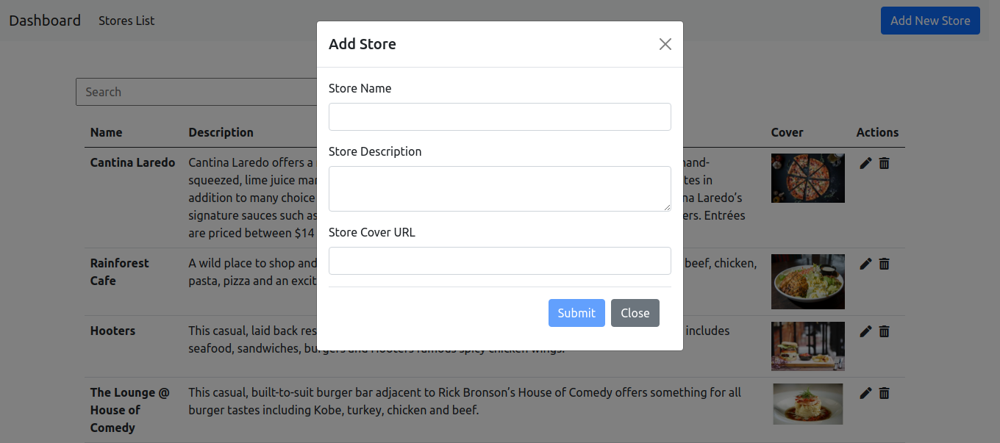

# food-court-task

Simple web application, for a food court stores you can add edit and remove store.

### Used Technologies and libraries

**BACK-END**

1. Node Js
2. Express

**DB**

3. Mongoose

**FRONT**

4.Anuglar

5.Bootstrap

**DEPOLAY AND OTHERS**

6.Docker

7.AWS

# AWS Deploy Link

```
http://18.118.170.64:8000/
```

# API

**Run APIS**

```
npm start
```

**Endpoints**

```
GET '/api/stores'

GET '/api/stores/:id'

patch '/api/stores/:id'

delete '/api/stores/:id'

POST '/api/stores/add-store
```

## GET ENDPOINTS

```
GET '/api/stores'
```

### Sample Response

```
{
"message": "Stores Data Extracted",
"data":
[
    {
        "_id": "6106e95f7273cac7067a6f90",
        "StoreID": 7,
        "StoreName": "Cantina Laredo",
        "StoreDescription": "Cantina Laredo offers a modern take on Mexican dining with made-from-scratch recipes and hand-squeezed, lime juice margaritas. ",
        "StoreLogo": "http://enozom.com/test/images/img7.jpg"
    },
    {
        "_id": "6106e95f7273cac7067a6f86",
        "StoreID": 17,
        "StoreName": "Rainforest Cafe",
        "StoreDescription": "A wild place to shop and eat, our dining safari has something for everyone including seafood, beef, chicken, pasta, pizza and an exciting kids menu.",
        "StoreLogo": "http://enozom.com/test/images/img17.jpg"
    },
]
```

```
GET '/api/stores/:id'
```

### Sample Response

```
{
    "message": "Store Data Extracted",
    "data": {
        "_id": "6106e95f7273cac7067a6f90",
        "StoreID": 7,
        "StoreName": "Cantina Laredo",
        "StoreDescription": "Cantina Laredo offers a modern take on Mexican dining with made-from-scratch recipes and hand-squeezed, lime juice margaritas. The extensive fresh menu includes traditional Mexican favorites in addition to many choice items such as grilled fish, chicken and steaks complemented by Cantina Laredo’s signature sauces such as chipotle-wine or sautéed artichoke hearts and roasted red bell peppers. Entrées are priced between $14 and $26. Vegetarian and gluten-free menus are available.",
        "StoreLogo": "http://enozom.com/test/images/img7.jpg"
    }
}
```

## POST ENDPOINTS

```
POST '/api/stores/add-store
```

### Sample Response

```
{
    "message": "Store Added Succefully",
    "data": {
        "_id": "610c486f6677983d2bc591ff",
        "StoreName": "KFC",
        "StoreDescription": "BEST Store Ever",
        "StoreLogo": "http://enozom.com/test/images/img8.jpg",
        "StoreID": 23,
        "__v": 0
    }
}
```

## PATCH ENDPOINTS

```
patch '/api/stores/:id'
```

### Sample Response

{
"message": "Store Data Updated",
"modified": 1
}

## DELETE ENDPOINTS

```
delete '/api/stores/:id'
```

### Sample Response

{
"message": "Store Deleted",
"deletedCount": 1
}

# Client

**Run Front**

```
npm start
```

## SCREENSHOTS FROM APPLICATION

**Home Page**


**Add New Store Dialog**


**Edit a Store Dialog**


